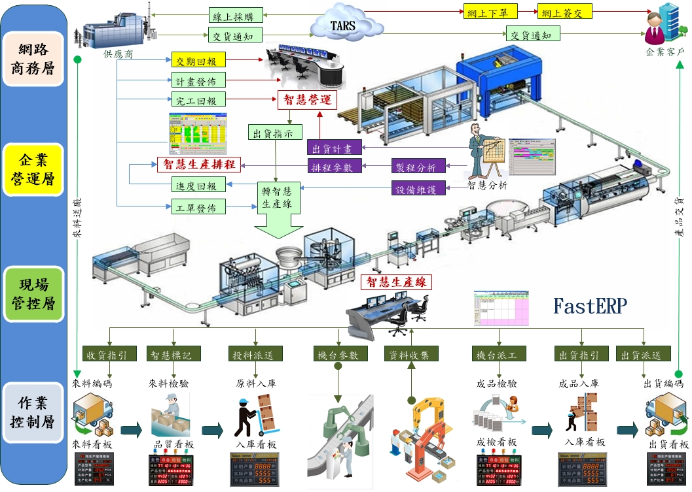
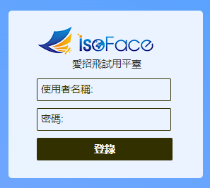
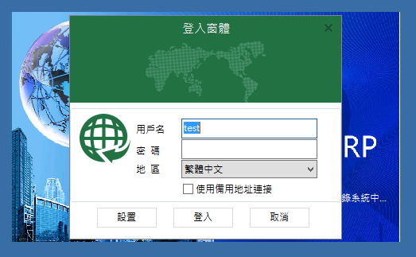

# FastERP
整合 ERP 與智慧物聯網，迎接智慧化企業。FastERP採用多種資料庫，簡易、快捷，將雲端商機與企業串聯在一起，Links Everything For You。不但輔助企業管理運轉，也提供經營資訊，消弭企業管理的鴻溝。免費的 FastERP 安裝即用，簡單運用無需編寫程式。即使編寫程式也無須編譯，直接執行看結果。採用設計與管理條件的選取方法，以所見即所得的操作畫面，快速完成軟體設計工作。並提供各種開源模板以供學習，簡化開發門檻。

> **加入 Facebook 社團**
>
> [https://www.facebook.com/groups/isoface/](https://www.facebook.com/groups/isoface/)
> 
> **點讚追蹤 Facebook 粉絲專頁**
> 
> [https://www.facebook.com/diylogi](https://www.facebook.com/diylogi)

FastERP結合IsoFace愛招飛四種軟體產品：

1. TARS數據伺服器，連線資料庫。並提供各種公共服務。
2. Smart工廠監控，整合工業用物聯網。
3. PinToo智慧設計移動裝置，設計行動APP。
4. FastWeb包括Web、RestAPI、WebSockets..等多種通訊伺服器，並支援IsoBean微服務平臺，搭配精簡快速的設計功能，不會寫程式也可快速設計管理軟體。

## 緣起

目前中小企業經管制度匯入e化的企業，多半仍停留於套裝及限於區域網路使用的軟體環境，效益不彰，更新成本更高。尤其以目前跨區、跨國企業居多，更造成資訊無法及時獲得。為解決這龐大市場需求，愛招飛團隊以多年時間，研發出讓中小企業自行設計運用的「FastERP系統」，已運用到不同產業中，期望能對於有意進行e化或自行新建構與轉換e化彈性自主環境的企業提供另外的選擇。

## FastERP特色

1. 可執行于多種操作系統，包括win2000、win XP、vista、win7、win10 均可隨即使用。

2. 自訂功能強大，軟體註冊後無版權與使用人數的限制，所有模組開發、均採用FastERP設計器。初次安裝FastERP之後，程式更新時無需安裝。可自行為企業開發不同需求功能，自訂功能表，所需功能自行設計，節省系統開發軟體成本。
 
3. 系統結構標準化、佈署、維護容易，FastERP已包裝成安裝檔案，主機啟動與關閉均可在短時間內完成，無需專業技能，也不需任何維護。數據備份快速，現有人員即可勝任，已不須再有專業系統維護人員的負擔。

4. 採用綠色安裝在單一執行檔中，呼叫資料庫中之模板，部署、更新，簡單、快速。

5. 程式模組均可自行開發，發展空間大且自主性高，隨需求增加可自行再加入。完美的軟體界面佈局功能，所有畫面均采視覺化設計，全部利用滑鼠視覺化操作。基本模組均已開發完成，可修改並隨需求再增加，此外模組使用的指令碼程式碼完全開放，遇有問題可自行修改或製作新模組，再經由TARS伺服器同步至所有使用者端。

6. 統一的開發平臺設計核心、控制數據流程、介面佈局。並提供基本模組、使用手冊及程式原始碼。讓企業能因不同階段需求可自行開發或修改，幷包括所有系統開發工具程式，內部人員培訓與維護容易進行。

7. 提供程式開發工具具備除錯功能，以所見及即所得之功能，除錯程式簡潔容易，並可提升程式開發效率。為使縮短例行性的程式開發流程(如維護程式或報表畫面安排、數據欄位格式、既定模組語法自動完成程式碼‧‧‧等),並提升指令碼程式開發與維護效率，均已提供必要開發工具模組，可自動以視覺化工具自動完成程式，並可隨不同需求再增加。

8. 程式與流程設計，可控制界面上每個控制項與欄位，業務邏輯從此與衆不同。並提供各類查詢條件模組設計，可任意指定所有軟體界面的數據過濾條件定，不再受制於硬性的設計。

9. 數據快取設計，讓軟體的執行速度箭步如飛，數據一次下載，各處使用。

10. 具備嵌入瀏覽器功能，與 FastWeb或其他網頁程式整合執行，

11. 整合直播服務與網路線上會議 共享桌面

12. 可與其它第三方軟體無縫銜接，一起使用。

## 開發測試說明

FastERP開發測試為協助開發者，測試IDE界面設計、瀏覽系統管理功能，修改結果不能儲存。

請使用 Chorme、Edge 等瀏覽器打開本頁面。建議顯示的解析度不低於1920 * 1080，以獲得更好的顯示效果。

1. 點選 [試用鏈接](https://www.diylogi.com) 試用ERP，進入測試網站登錄頁面。使用以下使用者名稱與密碼登錄測試環境。

使用者名稱：fasterp　密碼：demo 

2. 緊接著進入FastERP管理系統登錄頁面。使用以下使用者名稱與密碼登錄

使用者名稱：test　密碼：test

 
4. 如何檢視模組開發界面
    * 使用開發測試登錄
    * 開啟檢視模組配置界面的模組
    * 點選功能表欄中的設計-模組配置
    * 開啟模組設計界面，檢視模組的窗體配置資訊。詳情請參考[FastERP快速上手](https://isoface.net/isoface/doc/fasterp/quick-start/)。

* **FastERP 簡介**：https://isoface.net/isoface/production/software/fasterp/erp
* **FastERP 產品說明**：https://isoface.net/isoface/doc/fasterp/main/
* **FastERP 快速上手**：https://isoface.net/isoface/teaching/fasterp/1/
* **FastERP 無需安裝，線上試用**：https://isoface.net/isoface/support/trial/fasterp